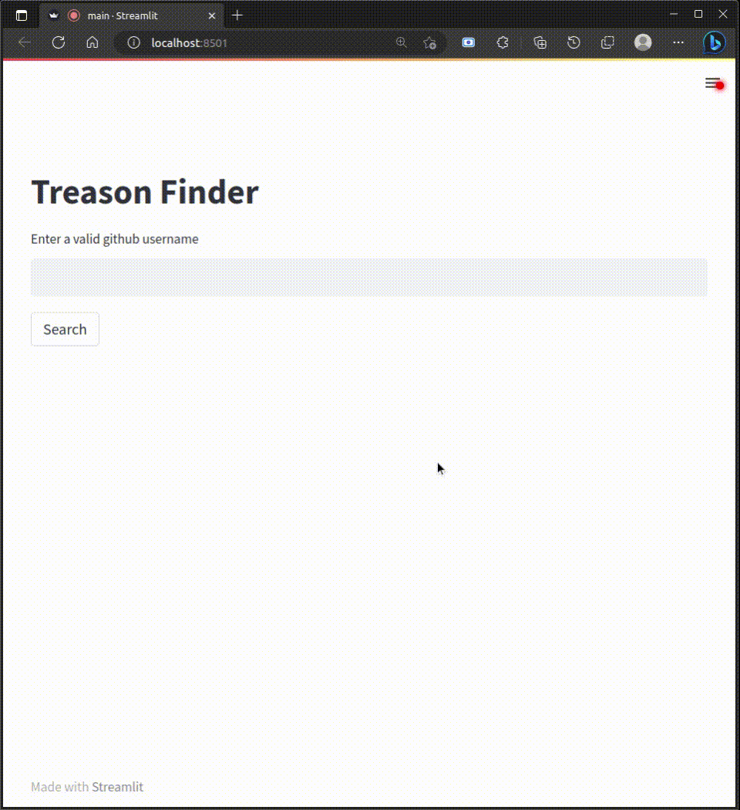

[](https://www.python.org/downloads/release/python-310/)
[](https://pypi.org/project/requests/2.28.2/)
[](https://pypi.org/project/beautifulsoup4/4.8.2/)
[](https://pypi.org/project/streamlit/1.22.0/)
# Treason Finder

A simple web app to find people not following you back on github :)

## Installation
1. Clone the repository:
```bash
git clone https://github.com/amdjedbens/Treason_Finder
#Or via SSH:
git clone git@github.com:amdjedbens/Treason_Finder.git
```   
2. Navigate to the project directory:
```bash
cd Treason_Finder
```
1. Install the required dependencies:
```bash
pip install -r requirements.txt
```
## Usage
To run the GitHub Follower Checker web application, execute the following command:

```bash
streamlit run main.py
```
<div align="center">
  
</div> 
<!-- <div align="center">
  <video controls>
    <source src="screen_record.webm" type="video/webm">
    Your browser does not support the video tag.
  </video>
</div> -->
## Authors
- [ZakariaR1ad ](https://github.com/ZakariaR1ad)
- [Amdjedbens ](https://github.com/amdjedbens)
## Contributing

Contributions are welcome! If you have any suggestions, bug reports, or feature requests, please feel free to open an issue or submit a pull request. 

## License

Check: [LICENSE](LICENSE)


